Carlos Beas, Reynaldo Martinez Cano

January 16, 2018  

# Segmenting Amorphous Background Regions with Mask R-CNN and COCO-Stuff

## Introduction

Convolutional Neural Networks (CNN) have become the “weapon of choice” when attempting to tackle image classification and segmentation tasks ever since Geoff Hinton extensively used them to [win the ImageNet Challenge in 2012](https://papers.nips.cc/paper/4824-imagenet-classification-with-deep-convolutional-neural-networks). This event has sparked a firestorm of innovation in the field and has led to the development of a multitude of variations of the CNN architecture optimized to perform the task faster or aiming to capture more of the complexity that takes place in human vision.  In addition, the large availability of labeled datasets for objects with well defined shapes (let's call it 'things':  'person', 'car', 'dog', etc) has generated significant advances in terms of segmentation performance for these classes of objects.

However, when it comes to the segmentation of amorphous 'background' regions (otherwise referred to as 'stuff', for objects such as patches of sky, trees, brick wall, etc.) the field has not seen as much interest, and consequently only a handful of dataset included labeled data for such categories. In 2017, the Common Objects in Context (COCO) consortium [challenged the notion that 'stuff' segmentation was not as relevant as thing segmentation is](https://arxiv.org/abs/1612.03716) and released a subsset of it's [dataset](http://cocodataset.org/#stuff-challenge2017) that was composed of 40K images of its 115K labeled images augmented to include pixel-level annotations for 91 stuff classes.  Where the aim is to enable the research and development of Deep Learning algorithms that are able to segment everything in an image and thus capture more of the complexity of human vision.

In this blog post, I will explain how we have used this new breakthrough in image labeling, along with the state-of-the-art MASK R-CNN architecture to perform stuff segmenation.

## Executive Summary

By combinining recent breakthroughs in CNN architecture that allow for segmentation of an image on a pixel-by-pixel level (enabling a model to determine whether a particular pixel belongs to an objcet or not) along with the advent of image datasets that provide pixel-by-pixel annotations for a large variety of background (stuff) classes, we set out to study the complexity involved in segmenting amorphous background objects.  
        
For this task, we used the state-of-the-art [Mask R-CNN architecture](https://arxiv.org/abs/1703.06870), developed by Kaiming He et al (2017) which is an extension to the previous Faster R-CNN. The architecture uses a Feature Pyramid Network (FPN) and a Resnet101 as backbones.

We where able to obtain significant results over some of the stuff categories. We additionally obtained important insights into the challenges associated with classifying background and amorphous targets.

The resulting model is able to detect and correctly classify background objects belonging to some of the 91 stuff categories.  We imagine that it could be used to be able to gain a deeper undersanding of the full context captured by and image once combined with 'thing' classification.  Where by current applications are able to detect thing objects in an image, having the information about what is in the background may help a machine determine what the objects are *doing* in the image or the reason for the objects to be in the image.
        

## Dataset

[Common Objects in Context (COCO)](http://cocodataset.org/#home) is a highly complex dataset of images containing intricate scenes that capture interactions between "things".  The dataset is able to accomplish this by providing highly detailed outlines of very small objects with pixel-by-pixel annotiations.   

In 2017, "COCO Stuff" was created as a curated subset of images in the dataset that were augmented to include annotations for 91 "stuff" classes.  The 2017 COCO dataset has a total of 335K training images, 115K of which are labeled for training, and 5k used for validation. The labeled training set has 2.4 million labeled instances for three key challenges: Detection, Keypoints, and Stuff. For the Stuff challenge (the one we cover in this blog post) only 40K training images of the 115K labeled images were augmented to include annotations for stuff classes.

The COCO 2017 Dataset images and annotation files are available for download [here](http://cocodataset.org/#download). The COCO Stuff Segmentation Challenge also has an extremely useful API available [here](https://github.com/nightrome/cocoapi) that provides an extensive number of functions to help extract the images id’s and class annotations. However, the current API was developed originally for the COCO 2014 Dataset in mind (before stuff annotations were added). It therefore takes some tweaking to get it adjusted to the Stuff challenge requirements but the API comes with many useful ipython notebook tutorials that make the transition easy, our version of the notebooks and code will be [published](https://github.com/cgbeas/Deep_COCO) in order to support further research in the topic.

## Model Selection

R-CNN’s (Regional CNN) introduced the concept of passing region proposals (obtained through a process called Selective Search) to a convolutional neural network for classification in the year 2012. The original R-CNN architecutre had two primary training difficulties, it had to train three different models (a CNN, a classifier and a regression model) and [required a forward pass for every region proposal for every image](https://blog.athelas.com/a-brief-history-of-cnns-in-image-segmentation- from-r-cnn-to-mask-r-cnn-34ea83205de4). 

A year later, two improvements were made to the R-CNN model; namely, the [Fast](https://arxiv.org/abs/1504.08083) and [Faster R-CNN](https://arxiv.org/abs/1506.01497). The Fast R-CNN main contribution was to treat all three models in the R-CNN as a single model that could be trained together. It also included the use of the softmax functions as the classifier. Faster R-CNN replaced the previous, and slower, process of region proposals to one where region proposals were obtained directly from the CNN’s feature maps. 
        
Finally, in 2017, the folks at Facebook AI Research (FAIR) led by Kaiming He developed [Mask R-CNN](https://arxiv.org/abs/1703.06870) which extends Faster R-CNN for semantic instance segmentation. This architecture adds a branch to Faster R-CNN (see iamge below) that ouputs whether an individual pixel is part of an object or not in parallel with the existing branch for bounding box recognition. It additionally introduced the RoI-Align functionality which helps fix misalignment issues caused by pixel level image segmentation. The figure below summarizes the architecture of Mask R-CNN.

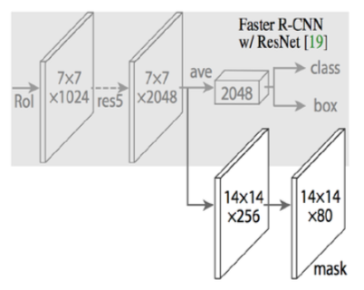

The Mask R-CNN architecture is a natural fit for tackling the task of stuff segmentation, particularly when using it in conjunction with the COCO Stuff dataset as both are aligned in facilitating pixel-level segmentation, which helps tremendously when classifying shapeless obecjts.

## Training Process

We used transfer learning to initialize our weights to a model pretrained on ImageNet, since the COCO dataset content is relatively similar to ImageNet.  The ResNet used in Mask R-CNN is divided into 5 stages and follows the 4-step training process used in Faster R-CNN; where stage 1 is comprised of the very first few dense layers (heads) of the network, these layers are used to extract the most common features in images. The training process fine-tunes the ResNet layers following a top to bottom approach, with the first step being the initialization using wieghts pre-trained on ImageNet, the second step used to train the stage 1 (head layers) for a total of 40 epochs.

Subsequently, for phase two we trained from stage 4 and up for 60 epochs. Fiinally, for phase three we trained from Stage 3 and up (100 epochs), for a total of 200 epochs for the entire training process and 1000 iterations per epoch.

The transitions from one training step to the next are clearly distinguishable in the training and validation loss curves where a significant increase at 40 epochs is observed after a constantly decreasing trend. The increase is attributed to additional entropy being generated from the addition of (previously untrained) dense layers.

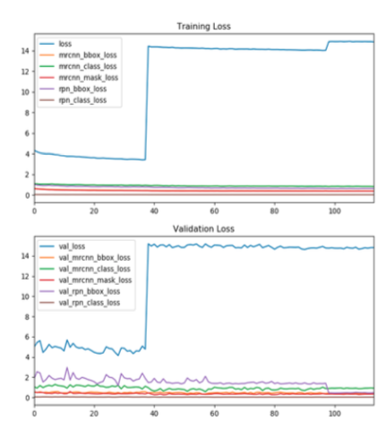

        - During training, images are re-sized such that their scale is 800 pixels.
        - Hyperparameters are set with a lerning rate of 0.001, a weight decay of 0.0001 and a momentum of 0.9.
 

## Data Exploration and Visualization

As explained earlier, the COCO dataset is broken down into multiple categories, with 'things' and 'stuff' being the top most super-categories.  Each is then further broken down into 'indoor' and 'outdoor' sub-categories.  At the 'bottom' of the category hierarchy we find the more fine-grain categoreis which specify such objects as 'person', 'dog', 'bridge', 'sky', etc.  Below is a visualization of this hierarchy and how it is organized.  
    
 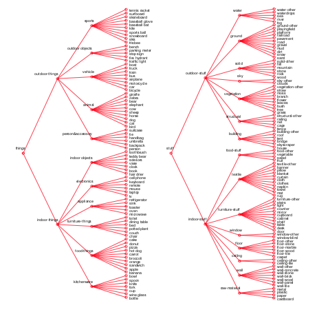
    
    
Each image in the COCO dataset is tied to an annotated 'mask' version of the picture detailing which pixels belong to which objects and their corresponding thing or stuff category. This represents what is known as the "Ground Truth" of the image and it is used during training to determine whether a categorical prediction is correct or not. 

<table>
<tr>
<td>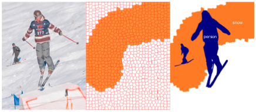</td>
<td>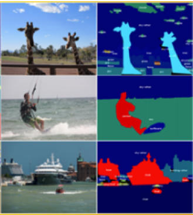</td>
</tr>
</table>

During training, each image is first passed through what is known as a Feature Pyramid Network (FPN).  The result is series of 'region proposals' or RPN which are sub-sections of the image which the CNN has found to contain that may be of interest for classification.  Below is an example of an image that has under-gone such process.
        
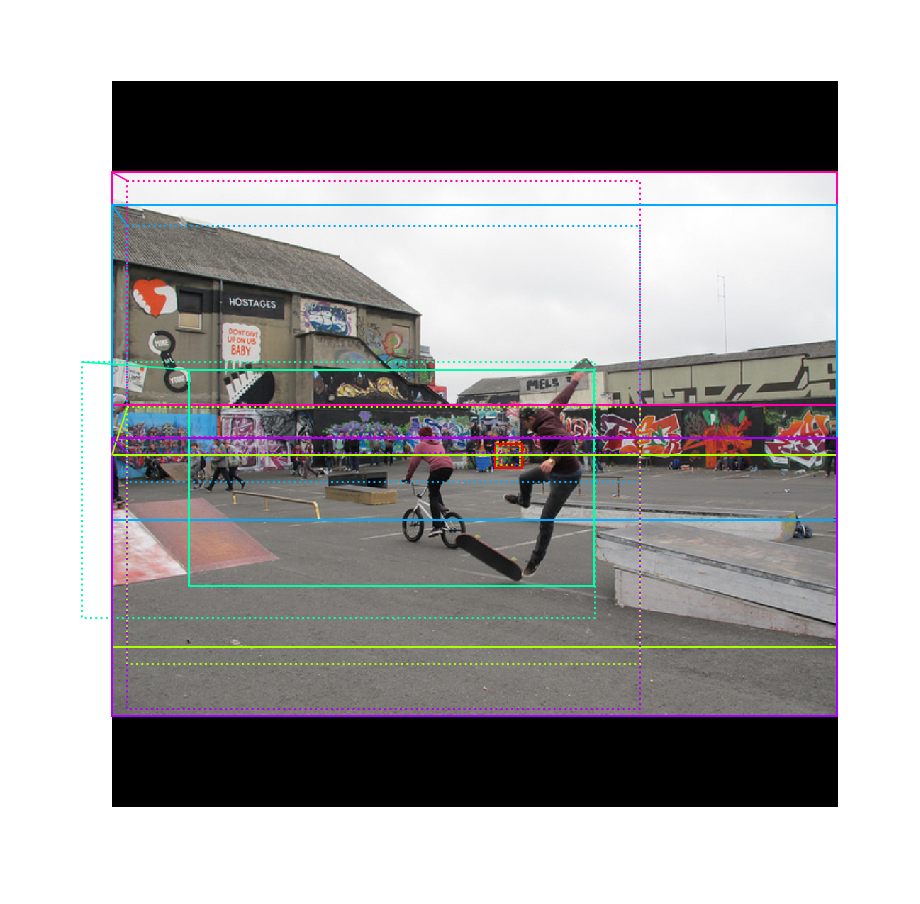
 

## Interpretation of Findings

A caveat that must be observed when training for stuff classification is the prescence of the stuff sub-category 'other'.  In essence, this category captures ony object that does NOT belong to any of the 91 stuff categories.  When training on the stuff dataset only, this becomes problematic since the 'other' category may encompass a very large amount of different objects, which can lead to unnecessary "confusion" when fine-tuning the weights of the network.
        
The Mask R-CNN architecture and methodology used over the course of this experiment was found to accurately predict some of the stuff categories very well.  The categories for which the network performs well tend to have the particularity of belonging to those classes which tend to manifest in high densities of pixels whenever present in an image.  Such classes include: 'sky', 'snow', 'sea', 'trees', among others.  Below is a summary chart showing the number of predictions made by our model per class, per ROI-configuration.
        
 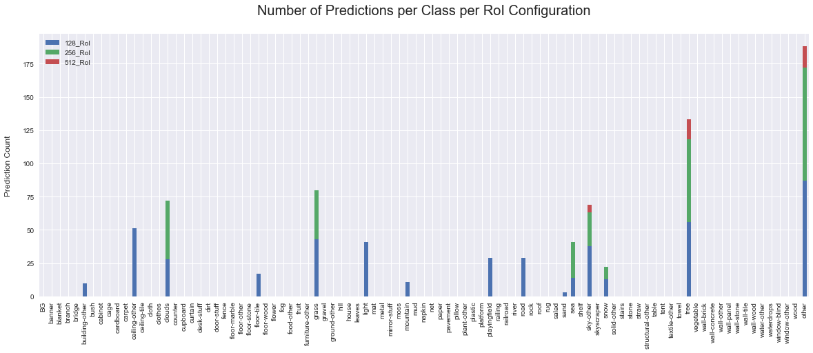
        

## Implementation Description 

For our implementation of Mask R-CNN, we used an open source baseline made available by Matterport, Inc. The github repository is available [here](https://github.com/matterport/Mask RCNN) and was developed for the COCO 2014 dataset for thing object classifications. We adjusted the model to our COCO 2017 needs. The model code implementation is in Python 3, Keras, and Tensorflow. It generates bounding boxes and segmentation masks for each instance of an object in the image and it is based on Feature Pyramid Network (FPN) and a ResNet101 backbone. The architecture configuration can be seen in the figure below.

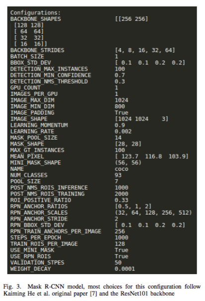

We initially trained our model on the COCO Stuff Dataset with the default configuration already described in the figure above. This default configuration has a learning rate of 0.002. The learning rate stays the same throughout the first stage of training (when trainig the head layers). At the start of a new training Stage, the learning rate decreases by a factor of 10. In other words, at Stage 2, learning rate equals 0.002/10 and at Stage 3 it is 0.002/100. Another thing to note is that Mask R-CNN feeds a certain number of regions of interests (RoIs) to the classifier and mask heads. In our configuration, we have that number set to 128 RoIs per image, however, the original paper has that number set up to 512.

## Parameter Tunning

We stopped training after epoch 115 in order to check if different approaches could boost training performance. We tried two different approaches: changing the learning rate and changing the number of RoIs that are fed to the classifier/mask heads per image. We designed two test cases using a learning rate of 0.01 and 0.005, respectively. These were tested with number of RoIs set to 128 (as in our original configuration). 
        
Additionally, we ran two more test cases setting the number of RoIs passed to the network heads to 256 and 512, respectively in order to better understand if doing so would improve the accurate prediction of stuff classes. These last changes maintained the same learning rate as our original configuration (0.002).

## Model Evaluation

To get an idea of how well the model performed with evaluation data, a confusion matrix including all 91 classes in COCO Stuff dataset is provided below in the form of a heatmap where the darker the intersection between a particular prediction and the corresponding ground truth the more such predictions were made.  Ideally, a perfect stuff classifier would form a dark diagonal that goes from the top left of the image down to the bottom right of it, and no other information found elsewhere in the matrix.  This would imply that every prediction made was in accordance with the ground truth.

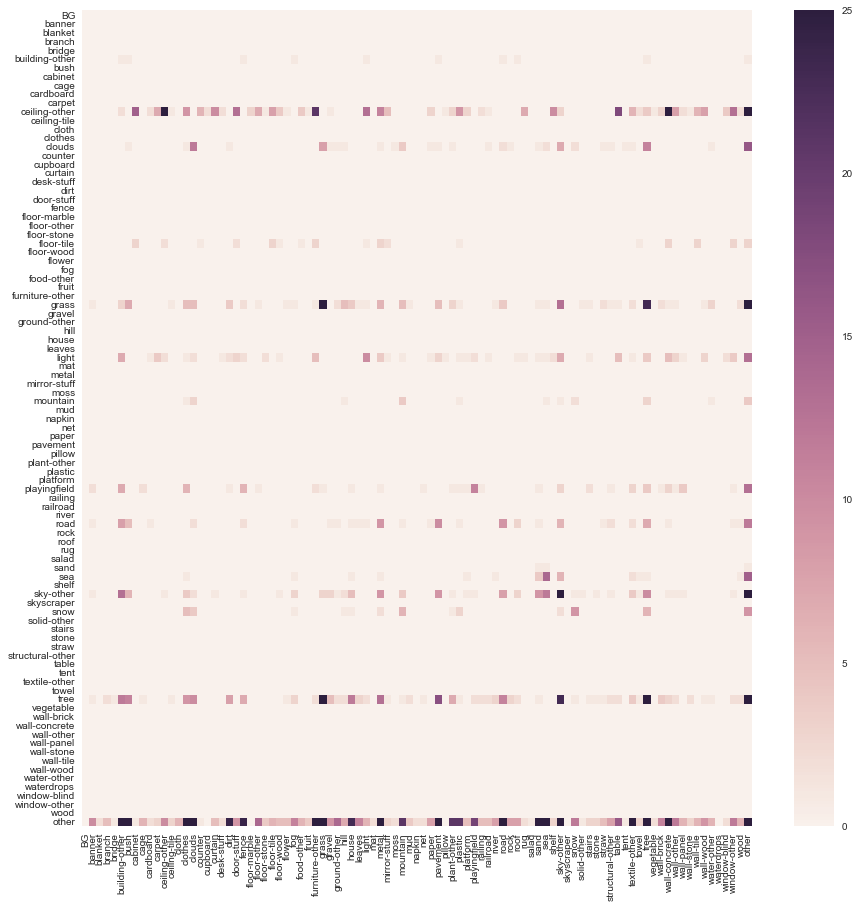

As can be observed, this is not the case for our trained model.  Yes, there is the outlines of a diagonal starting to form in the matrix for some of the category.  However, by and large, one can observe a substantial amount of incorrect predictions and disproportionate amount of confusion occuring at the bottom of the matrix, corresponding to the predictions for the 'other' category.  
        
Only a handful of categories end up demonstrating good ability to be learned and those, as explained earlier, tend to be categories which manifest in high densities of pixels whenever present in an image.
        
We now present this information in a different format, showing only the categories that have at least one prediction (y-axis) and their corresponding ground truths (x-axis).  By "compressing" the matrix this way, we can distinguish that, a disproportionate amount of 'other' ground truths is present in the data. This leads us to hypothesize that by having the 'other' category included in the dataset, we are encouraging the network to get 'distracted' by it instead of focusing on its actual task, which is to learn the rest of the 'stuff' categories.
        
 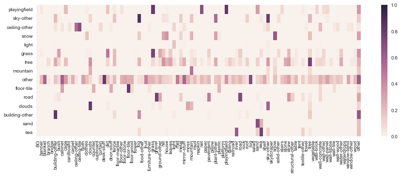
 

## Predicting Stuff and Confusing Stuff

We now present some examples of the resutls we were able to achieve.  One of the best we found, was the image below where the network was able to classify correctly most of the classes represented in the image and incur in relatively minimal 'overlap'. 

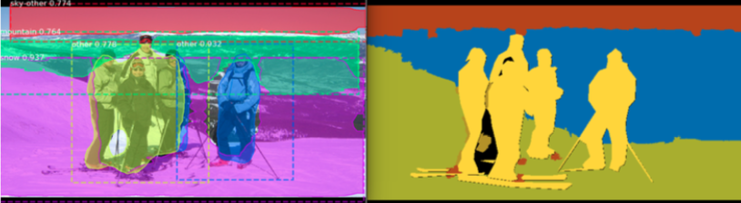

<table>
<tr>
<td>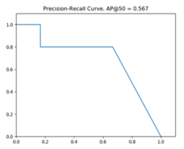</td>

<td>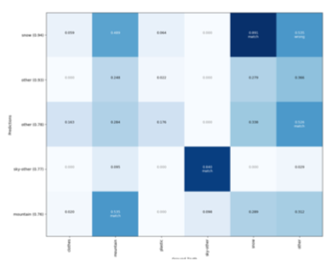</td>
</tr>
</table>

In contrast, below we present a "collage" of some of the images where prediction was not so accurate and show a large preference towards the 'other' category.

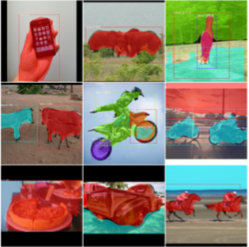

## Model Optimization Results

For the first test cases, we varied the learning rate with new values, 0.01 and 0.005. Unfortunately, the gradients exploded as soon as we started training with a learning rate of 0.01. Similarly, learning rate of 0.005 exploded starting epoch 25. Our model was also not able to train better with larger learning rates than 0.002.
        
We had an interesting finding when dealing with larger RoIs, too. The loss graph shown above, was obtained from training 115 epochs at 128 RoIs per image.  The model that feeds 256 RoIs had a lower loss (figure below on the left) than the one that feeds 128 RoIs to the network but a lower average precision (mAP = 0.004). Similarly, the model that fed 512 RoIs performed the best during training (figure below on the right) but had the worst average precision (mAP = 0.001).

<table>
<tr>
<td>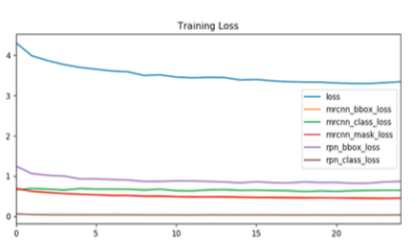</td>
<td>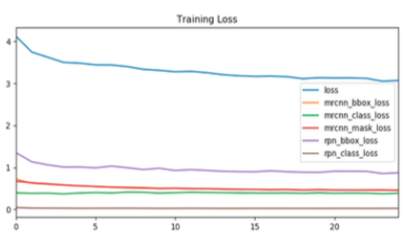</td>
</tr>
</table>
 
        
## How Might The Model Be Improved

So in general terms, MASK R-CNN + 2017 COCO-stuff Dataset + ImageNet leads to some level of stuff segmentation.
Given the observations made during this initial aproach, a clear path forward would be to develop and implement a pre-processing step that can aid in filtering out the “other” class altogether. This will help the model focus on learning the features and representations of actual stuff classes. 

In order to overcome pixel-density limitations and constarints for some of the classess in the dataset, one could attemot to generate additional/synthetic data that may facilitate further learning for these classes.  One methodology to achieve this is through the use of data augmentation methods, wherby one may generate multiple "new" samples of data by warping, shifting, rotating an existing image that is considered a strong candidate for the objects one wishes to classify.
In addition, an second plausible avenue is to consider the use a [Generative Adversarial Network](https://en.wikipedia.org/wiki/Generative_adversarial_network) to generate new synthetic samples of images which artificially creates a prominent precense of the object one wishes the network to learn.  

Finally, Building a network that tries to classify both thing and stuff classes simultaneously may prove to be a more promising route.  In this case, the idea would be to build a model that is able to reliabily classify all things and stuff classes and is able to segment everything in an image. In fact, this is already the focus and subject of [ongoing research](https://arxiv.org/abs/1711.10370) and has shown to be a promising area for future development.

